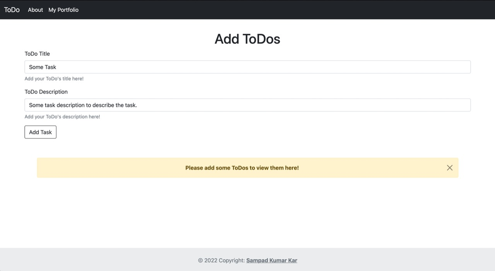
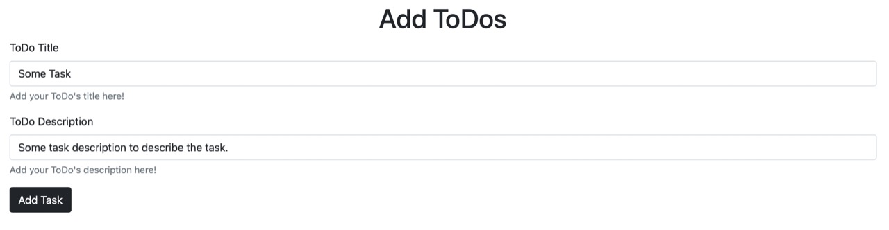
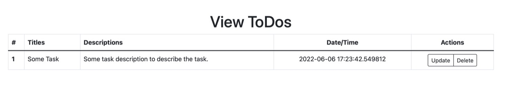
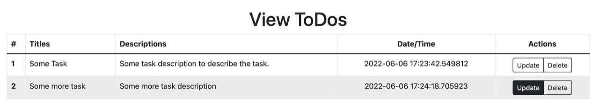
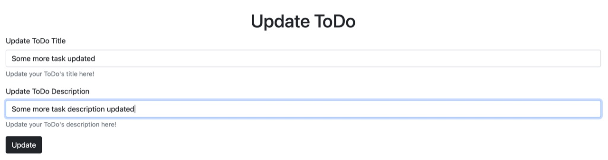
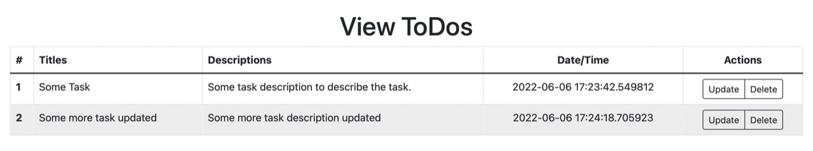

# myToDo

## Test the webapp @[https://webappmytodo.herokuapp.com](https://webappmytodo.herokuapp.com)

## Snaps

## How to Use?
Add the **title** of your task in the title box.
Add the **description** of your task in the description box
Click on the **Add Task** button to add the task to you **ToDo List**.

View your task in the **ToDo List**.

Update/Delete your task by clicking on the relevant buttons in the **ToDo List**.

## Tools Used
- Python
- Flask, Flask SQLAlchemy
- HTML, CSS(Bootstrap)
- SQLite
- Heroku(Deployment)
